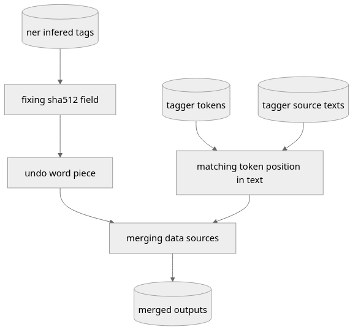

# Data processing pipeline

## Pipeline summary

This pipeline aims to compare tagged data from a simple regex based tagger (from here on referred to as *tagger*)
and a natural language processing model (here on out referred to as *NER*) to check for overlaps and differences in output for the same input.

A rough representation of the processing done on the input data can be observed in the following diagram.

A few rounds of cleanup have been necessary to make the data usable and will be described in the following sections.

## Data format & structure

The data is structured in a columnar like format with two main columns.
The `sha512` column contains the hashed value of the source text.
The `ner_positions` column contains a python dictionary of various tag properties such as the tag name, the tagged word, its beginning position in character offset and its end position in character offset.

Data structure:
- sha512 (text): hashed source text
- ner_positions (text): text representation of:
  - (dict): dict from tag name (text) to:
    - (list): an unordered list of match of the form:
      - (dict): a record of a tagged word with the following keys:
        - "char_start" (int): the beginning position of a tagged word in character offset
        - "char_end" (int): the position of the next character after the word end in character offset
        - "word" (text): the tagged word
        - "src" (list): a list of data origins (text)

Note that this data structure is the "ideal" data structure and that the input data does not conform to this model.
The preprocessing stages aim to normalize the input data's format to be as close to this ideal model.
The output data conforms to this model.

## NER specific preprocessing

The NER data used as input has an erroneous `sha512` column and pieced tags.

### Fixing the sha512 field

The raw NER input data includes a `sha512` column. However this column contains an id that is not the sha512 hash.

In order to be able to match the data from this data source, the sha512 column must be recomputed.
In order to recompute this text, the fields in the column `description` is hashed using *sha512*.
The `description` column contains the source chunks of texts used in the NER to generate the tags.

This step thus replaces the `sha512` column with its expected value.

### Undoing word piece

The tags in the NER sourced input are sometimes split mid word using BILOU tagging.
This steps aim to piece back tags together so that contiguous tags in a text be merged as one.
This merging is done per text, per tag.

Note that this step removes BILOU tag prefixes as they would be meaningless once combined.

## Tagger processing

The tagger input data is split in two datasets.
The *tagger tokens*, an ordered list of tokens, with appropriate tags from sourced texts.
The *tagger source texts*, a list of source text used for tagging.

### Finding token positions

In order to merge the tag data with the NER it is required to extract the position of relevant tags.
This step aims to match token by token in the source text and extract their position in character offset.
For each tag, a tag record can then be generated in the form expected in the idea data structure (except the "src" field).

None that `O` tag (not matching any categories) are discarded at this step.

## Merging the two inputs

After the aforementioned preprocessing the two input sources can then be merged.
The "src" property lists which source exibits the tag.
